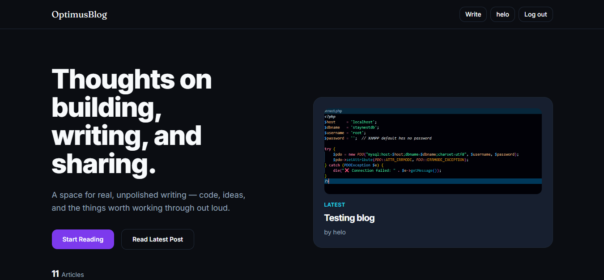
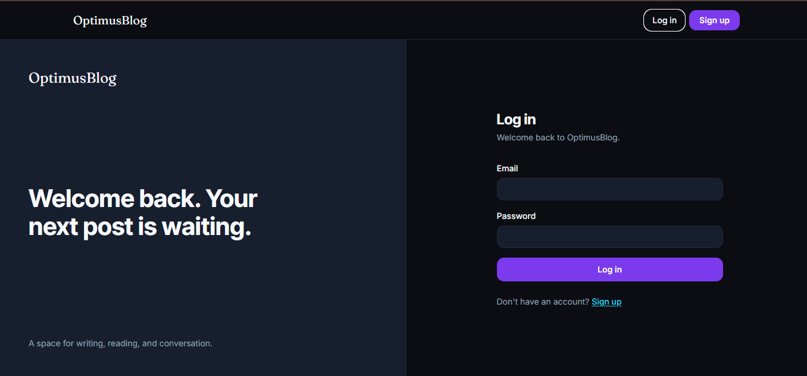
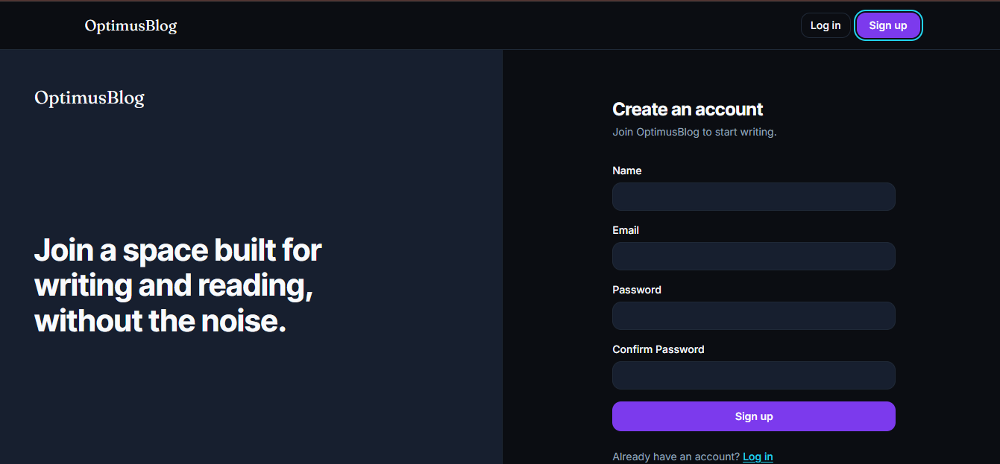
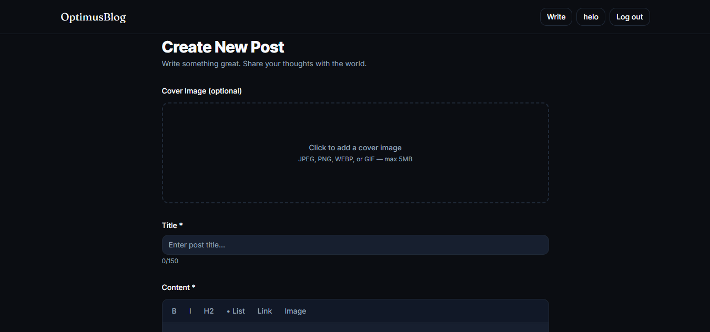
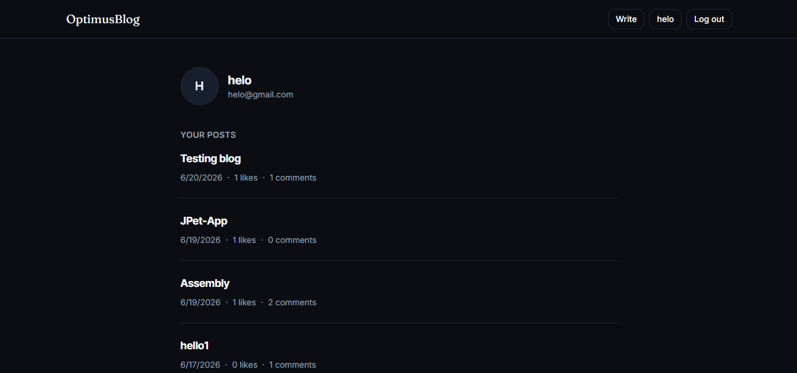

# OptimusBlog

> A full-stack MERN blogging platform with authentication, rich-text editing, image uploads, and threaded discussions — built and deployed end to end.

Built during the Optimus Automate Full Stack Development Internship (Project 1 of 3).

**[Live Demo](https://optimus-automate-optimus-blog.vercel.app)** · **[API](https://optimusblog-production.up.railway.app/api/health)**

---

## Screenshots

### Home Feed


### Login


### Register


### Create Post


### Profile


## Highlights

- Full-stack MERN application, built and deployed from scratch
- Production deployment using Vercel, Railway, MongoDB Atlas, and Cloudinary
- Custom dark design system (color tokens, typography scale, component library) built from scratch, not a default template
- JWT-based authentication with server-side authorization checks, not just hidden UI buttons
- RESTful API with a consistent response shape across every endpoint
- Direct-to-cloud image streaming (no local disk dependency, deploy-safe)
- One-level comment threading enforced at the application layer

## Features

- User registration and login (JWT-based authentication)
- Create, edit, delete, and publish/draft blog posts
- Rich text editor (Tiptap) with inline image support
- Cover image upload via Cloudinary
- One-level nested comments (replies to top-level comments only)
- Post engagement system with authenticated like/unlike toggling
- Author-only edit/delete permissions, enforced server-side
- Paginated home feed with search
- User dashboard with author-specific post visibility, including unpublished drafts

## Tech Stack

### Frontend
- React
- Vite
- Tailwind CSS
- React Router
- Axios
- Tiptap
- DOMPurify

### Backend
- Node.js
- Express
- MongoDB / Mongoose
- JWT
- bcrypt
- Multer

### Services & Deployment
- MongoDB Atlas (database)
- Cloudinary (image storage)
- Railway (backend hosting)
- Vercel (frontend hosting)

## Design System

The interface uses a custom dark color system rather than default Tailwind grays:

| Token | Value | Use |
|---|---|---|
| `bg` | `#0B0D12` | Page background |
| `card` | `#171F2F` | Cards, inputs, elevated surfaces |
| `primary` | `#7C3AED` | Primary actions (buttons, active states) |
| `secondary` | `#22D3EE` | Links, focus rings, accents |
| `text` / `muted` | `#F8FAFC` / `#94A3B8` | Primary and secondary text |

Headings use **Inter Tight**; body text uses **Inter**; code uses **JetBrains Mono**. All color and spacing decisions live in `tailwind.config.js` as design tokens, not hardcoded throughout components.

## Architecture

```
                    User
                     │
                     ▼
          Vercel — React + Vite SPA
                     │
                     │  Axios (JWT in Authorization header)
                     ▼
          Railway — Express REST API
                     │
          ┌──────────┴──────────┐
          ▼                     ▼
   MongoDB Atlas           Cloudinary
   (users, posts,          (cover images,
    comments)               inline images)
```

The frontend never talks to MongoDB or Cloudinary directly — every read and write goes through the Express API, which handles auth checks, validation, and authorization before touching the database or storage layer.

## Security

- JWT authentication with expiry
- Password hashing with bcrypt (passwords never stored or returned in plaintext)
- Protected routes via reusable `verifyJWT` middleware
- Server-side authorization checks on every mutation (`req.user.id === resource.author`), not just hidden frontend buttons
- `optionalAuth` middleware for routes that are public but behave differently when authenticated (e.g. draft visibility)
- Frontend HTML sanitization (DOMPurify) before rendering any user-generated rich text
- File type and size validation on all uploads
- Rate limiting on authentication endpoints
- CORS restricted to a specific frontend origin, never `*`
- No stack traces or internal error details exposed in production responses

## Architecture Notes

A few decisions worth calling out, since they weren't the default/obvious choice:

- **Image uploads stream directly to Cloudinary** using `multer.memoryStorage()` + `cloudinary.uploader.upload_stream()`, rather than using the `multer-storage-cloudinary` package. That package only supports Cloudinary SDK v1 as a peer dependency, which conflicts with the v2 SDK used here. Streaming the buffer directly avoids the dependency conflict entirely and never touches the server's local disk — important since most free hosting platforms (Railway included) use ephemeral filesystems that don't persist uploaded files between deploys.

- **Comments support exactly one level of nesting** (a comment can have replies, but replies cannot themselves be replied to). This is enforced in the controller, not just the schema, so the API rejects a reply-to-a-reply with a clear `400` error rather than silently allowing infinite threading. Infinite nesting adds real complexity (recursive rendering, recursive deletes) for limited practical benefit on a blog's comment section.

- **Drafts are only visible to their author**, enforced via an `optionalAuth` middleware — a route that's public (so anyone can read published posts) but still identifies a logged-in user if a valid token is present, without rejecting anonymous requests. This lets an author preview their own unpublished draft while keeping it a 404 for everyone else.

- **Likes are stored as an array of user IDs**, not a counter, so the API can answer "has *this* user liked this post" and prevent duplicate likes — a counter alone can't do either.

## Testing

No automated test suite yet. Manual testing was performed end to end, both locally and against the live deployment, covering:

- Registration, login, and protected-route access/rejection
- Post CRUD, slug generation, draft vs. published visibility
- Comment creation, one-level reply enforcement, and reply-to-a-reply rejection
- Image upload (cover image and inline editor images)
- Like/unlike toggling
- Author-only authorization on edit/delete (verified as both the author and a non-author)
- Full deployment path: Vercel → Railway → MongoDB Atlas → Cloudinary

## Prerequisites

- Node.js >= 20
- A MongoDB Atlas account (free tier is sufficient)
- A Cloudinary account (free tier is sufficient)
- Git

## Local Setup

### Backend

```bash
cd backend
npm install
cp .env.example .env
npm run dev
```

Required environment variables (`.env`):

```env
PORT=5000
NODE_ENV=development

MONGO_URI=
JWT_SECRET=
JWT_EXPIRES_IN=7d

CLOUDINARY_CLOUD_NAME=
CLOUDINARY_API_KEY=
CLOUDINARY_API_SECRET=

CLIENT_URL=http://localhost:5173
```

Runs on `http://localhost:5000`.

### Frontend

```bash
cd frontend
npm install
cp .env.example .env
npm run dev
```

Required environment variable (`.env`):

```env
VITE_API_URL=http://localhost:5000/api
```

Runs on `http://localhost:5173`.

### Where to get each variable

| Variable | Where to get it |
|---|---|
| `MONGO_URI` | MongoDB Atlas → Database → Connect → Drivers → Node.js |
| `JWT_SECRET` | Any long random string you generate yourself |
| `CLOUDINARY_*` | Cloudinary Dashboard (shown immediately after signup) |
| `CLIENT_URL` | The deployed frontend's URL in production, `http://localhost:5173` locally |
| `VITE_API_URL` | The deployed backend's URL + `/api` in production, `http://localhost:5000/api` locally |

### Running Both

```bash
# Terminal 1
cd backend
npm run dev

# Terminal 2
cd frontend
npm run dev
```

## Deployment

| Layer | Platform |
|---|---|
| Frontend | Vercel |
| Backend | Railway |
| Database | MongoDB Atlas |
| Image storage | Cloudinary |

Each platform is configured with its own environment variables (see above); none are committed to the repository. The backend's `CLIENT_URL` is set to the live Vercel domain to restrict CORS to the actual production frontend.

## API Overview

| Method | Route | Auth | Description |
|---|---|---|---|
| POST | `/api/auth/register` | — | Create an account |
| POST | `/api/auth/login` | — | Log in |
| GET | `/api/auth/me` | Required | Get current user |
| GET | `/api/posts` | Optional | List posts (paginated, searchable, filterable by author) |
| GET | `/api/posts/:slug` | Optional | Get a single post (drafts visible to author only) |
| POST | `/api/posts` | Required | Create a post |
| PUT | `/api/posts/:id` | Required (author) | Update a post |
| DELETE | `/api/posts/:id` | Required (author) | Delete a post |
| POST | `/api/posts/:id/like` | Required | Toggle like |
| GET | `/api/posts/:id/comments` | — | List comments on a post |
| POST | `/api/posts/:id/comments` | Required | Add a comment or reply |
| DELETE | `/api/comments/:id` | Required (author) | Delete a comment |
| POST | `/api/uploads/image` | Required | Upload an image to Cloudinary |

All responses follow a consistent shape:

```json
{
  "success": true,
  "message": "Post fetched successfully",
  "data": {
    "post": {
      "title": "My First Blog Post",
      "slug": "my-first-blog-post",
      "status": "published"
    }
  }
}
```

Errors follow the same shape with `success: false`:

```json
{
  "success": false,
  "message": "Not authorized to edit this post"
}
```

## Future Improvements

These are known gaps in the current implementation, not yet addressed:

- Frontend sanitization (DOMPurify) is implemented and protects every reader regardless of what's stored in the database. Server-side sanitization is not yet implemented — it's a planned defense-in-depth addition so the stored data is safe at rest, not just at render time.
- Image upload validation currently returns a generic `500` error if the file filter rejects a file, instead of a clean `400` with a specific message.
- No automated test suite (unit/integration tests) yet — testing so far has been manual, as described above.
- Post categories/tags are not yet implemented at the data layer; the homepage currently organizes posts by recency only.

## Project Structure

```
OptimusAutomate_OptimusBlog/
├── frontend/    # React + Vite SPA
└── backend/     # Express API
```

Both apps live in a single repository with separate `frontend/` and `backend/` subfolders, deployed independently (Vercel reads from `frontend/`, Railway reads from `backend/`), per the internship's submission requirement of one repository per project.

## Author

Abdul Haq

## License

This project is for educational purposes, built as part of the Optimus Automate Virtual Internship Program — Full Stack Development track. No formal open-source license is applied.

---

Built for the [Optimus Automate](https://optimusautomate.com/) Full Stack Development Internship.
